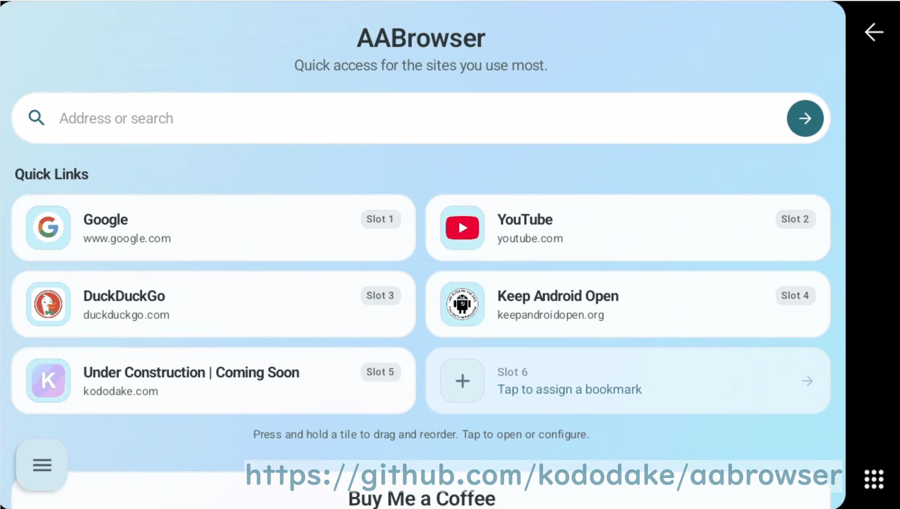

#  AA Browser

[](https://apps.obtainium.imranr.dev/redirect?r=obtainium://app/%7B%22id%22%3A%22com.kododake.aabrowser%22%2C%22url%22%3A%22https%3A%2F%2Fgithub.com%2Fkododake%2FAABrowser%22%2C%22author%22%3A%22kododake%22%2C%22name%22%3A%22AABrowser%22%2C%22preferredApkIndex%22%3A0%2C%22additionalSettings%22%3A%22%7B%5C%22includePrereleases%5C%22%3Afalse%2C%5C%22fallbackToOlderReleases%5C%22%3Atrue%2C%5C%22filterReleaseTitlesByRegEx%5C%22%3A%5C%22%5C%22%2C%5C%22filterReleaseNotesByRegEx%5C%22%3A%5C%22%5C%22%2C%5C%22verifyLatestTag%5C%22%3Afalse%2C%5C%22sortMethodChoice%5C%22%3A%5C%22date%5C%22%2C%5C%22useLatestAssetDateAsReleaseDate%5C%22%3Afalse%2C%5C%22releaseTitleAsVersion%5C%22%3Afalse%2C%5C%22trackOnly%5C%22%3Afalse%2C%5C%22versionExtractionRegEx%5C%22%3A%5C%22%5C%22%2C%5C%22matchGroupToUse%5C%22%3A%5C%22%5C%22%2C%5C%22versionDetection%5C%22%3Atrue%2C%5C%22releaseDateAsVersion%5C%22%3Afalse%2C%5C%22useVersionCodeAsOSVersion%5C%22%3Afalse%2C%5C%22apkFilterRegEx%5C%22%3A%5C%22%5C%22%2C%5C%22invertAPKFilter%5C%22%3Afalse%2C%5C%22autoApkFilterByArch%5C%22%3Atrue%2C%5C%22appName%5C%22%3A%5C%22%5C%22%2C%5C%22appAuthor%5C%22%3A%5C%22%5C%22%2C%5C%22shizukuPretendToBeGooglePlay%5C%22%3Afalse%2C%5C%22allowInsecure%5C%22%3Afalse%2C%5C%22exemptFromBackgroundUpdates%5C%22%3Afalse%2C%5C%22skipUpdateNotifications%5C%22%3Afalse%2C%5C%22about%5C%22%3A%5C%22%5C%22%2C%5C%22refreshBeforeDownload%5C%22%3Afalse%2C%5C%22includeZips%5C%22%3Afalse%2C%5C%22zippedApkFilterRegEx%5C%22%3A%5C%22%5C%22%7D%22%2C%22overrideSource%22%3Anull%7D)

**The ultimate WebView browser experience for Android Auto head units.**
Transform your "parked time" with a sleek, modern browser designed specifically for the road.

> [!CAUTION]
> **Beware of Fake Websites**
> Fake websites impersonating AA Browser have appeared. **This GitHub repository (https://github.com/kododake/AABrowser) is the ONLY official source.** To prevent malware infections and financial damage, absolutely do not trust or download from any other websites.

> [!NOTE]
> **Requires Android 15 or later**
>
> 📲 **Easy Install:** No need for a special installer. Just download and install.
>
> 🚀 **Updates:** Using **[Obtainium](https://github.com/ImranR98/Obtainium)** (linked above) is recommended to keep the app automatically up to date without limitations. Alternatively, you can download the APK from [GitHub Releases](https://github.com/kododake/AABrowser/releases).

---

  

## ✨ Key Features

- 🎨 **Material 3 Expressive UI:** Built specifically for car screens with fluid expressive animations, modern bottom sheets, and true-black AMOLED theme.
- 🎬 **Immersive Video & Fullscreen:** Stream DRM-protected video (Widevine L3) and toggle instant fullscreen with a single tap for parked entertainment.
- 🚀 **Dynamic Start Page:** Up to 6 quick-link tiles with smooth drag-and-drop reordering, cached site icons, and custom background image support.
- 🗂️ **Desktop-Class Tab Management:** Easily open, switch, close, and restore multiple browser tabs directly from your dashboard.
- 🚗 **Car-First Controls:** One-touch mobile/desktop mode switching, global UI scaling, and intuitive bookmark management designed for head units.

### 📸 Screenshots

  
  

---

## 📱 Quick Start & Safety 🚦

#### 🛑 Developer's Safety Request

* **Driver's Duty:** If you're the one steering, **DO NOT LOOK AT THIS APP.** If you think your eyes might wander while driving, **uninstall it right now!** Seriously, your safety is my top priority.
* **Passenger's Joy:** This app is for your passengers or for when you are safely parked.
* **Legal Note:** I built the code, but the **GPLv3 license** means I am **NOT RESPONSIBLE** for your actions. Drive smart!

---

#### 🛠️ How to Enable Unknown Sources on Android Auto

To use this app, you must unlock the hidden Developer Settings.

1. **Open Android Auto Settings:** Search for "Android Auto" in your phone's settings.
2. **Unlock Developer Mode:** Scroll to the bottom and **tap the "Version" section 10 times**. Tap **OK** on the pop-up.
3. **Open Developer Settings:** Tap the **three-dot menu (⋮)** in the top-right corner -> **Developer settings**.
4. **Enable Unknown Sources:** Find the **Unknown sources** checkbox and turn it on.

---

## ❓ Troubleshooting

**App not starting?**
If the app fails to launch, try opening a non-Google Maps navigation app (such as **Waze**) first, then open AA Browser.

---

## ⚠️ Current Issues

- 🚫 **No Ad Blocking:** Ad filtering is not currently implemented (contributions welcome!).
- 🚗 **Stationary Use Only**

---

## 🤝 Contributors

Every contribution makes AA Browser better!

- 🐛 **Found a bug?** Check for existing issues and open a new one with reproduction steps if none are found.
- 💡 **Got an idea?** Start a discussion.
- 🔧 **Wanna code?** Fork the repo and submit a PR!
- 📸 **Show it off:** Share a photo of AA Browser on your dashboard in the Discussions tab!

<table width="100%">
  <tr>
    <td align="center" valign="top" width="20%">
      <a href="https://github.com/kododake">
         
        <b>kododake</b>
      </a> 
      Project Lead & Maintainer
    </td>
    <td align="center" valign="top" width="20%">
      <a href="https://github.com/cmacrowther">
         
        <b>Colin Crowther</b>
      </a> 
      Original Design
    </td>
    <td align="center" valign="top" width="20%">
      <a href="https://github.com/jigneshbhavani">
         
        <b>jigneshbhavani</b>
      </a> 
      Microphone Support
    </td>
    <td align="center" valign="top" width="20%">
      <a href="https://github.com/SaveEditors">
         
        <b>SaveEditors</b>
      </a> 
      Multi-tab support,Original Home screen
    </td>
    <td align="center" valign="top" width="20%">
      <a href="https://github.com/gregorixG">
         
        <b>gregorixG</b>
      </a> 
      Desktop site UA handling
    </td>
  </tr>
</table>

---

## 🛡️ Privacy, Reimagined
I care about the app's growth, but I care about your privacy even more. This app is designed with a **Transparency-First** policy:

> [!IMPORTANT]
> **I have ZERO interest in your browsing habits.**
> - 🚫 **No URL Tracking:** I don't (and physically can't) see which websites you visit, what you search, or what you type.
> - 🕵️ **Self-Hosted Analytics:** I use a private **Umami** instance. No IP track, No Google, No Meta, no Big Tech trackers.
> - 🆔 **Anonymous Data:** I only see **"The app was opened"** and **This App Versions**. I use a random, anonymous UUID that isn't tied to your device ID or personal info.

---

## ☕ Support a Student Developer

If AA Browser makes your "car life" better, please consider sponsoring this project! As a student developer on a tight budget, your support covers daily expenses.

*(Direct link: [Buy Me a Coffee](https://buymeacoffee.com/kododake) / [GitHub Sponsors](https://github.com/sponsors/kododake))*

*If you sponsor the project, please let me know in the Discussions! I'd love to add you to our sponsors list as a token of my gratitude.*

---
**Stay safe, keep your eyes on the road, and happy browsing! 🚗💨**
